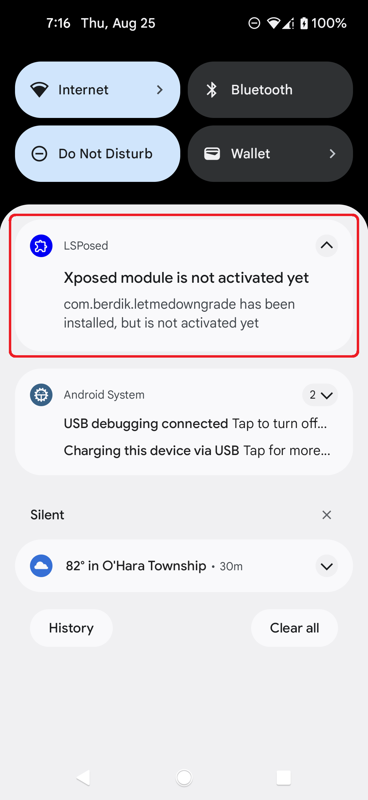
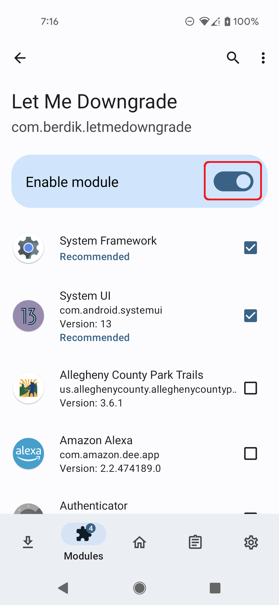
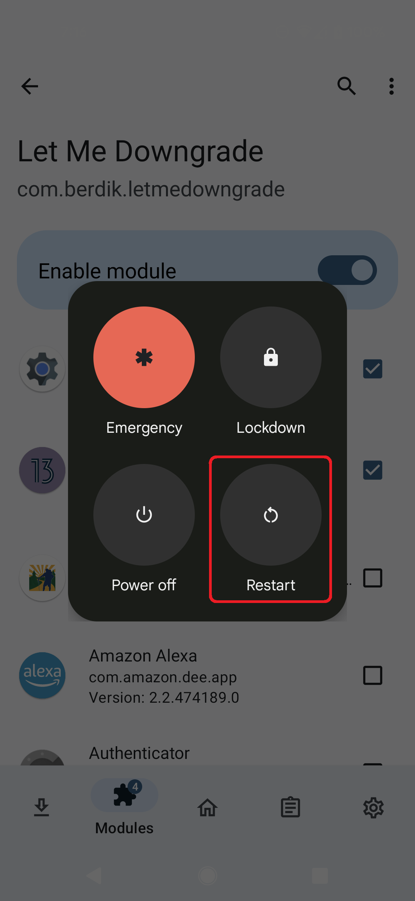
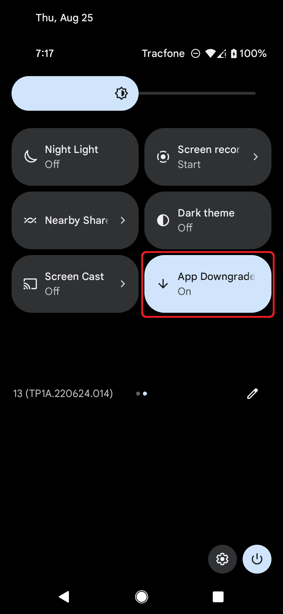

# Let Me Downgrade

Android's app installation system does not allow users to downgrade to an older version of an app when they already have a newer version installed. Let Me Downgrade is an Xposed module for Android 12 and 13 that enables users to bypass this restriction. As an added bonus, Let Me Downgrade provides a Quick Settings tile to easily enable and disable the downgrade block.

**⚠️ WARNING:** Let Me Downgrade is intended for rooted devices running Android 12 or 13 and requires Xposed. The recommended Xposed variant to use is LSPosed. Other Xposed variants may work, but have not been tested. Additionally, this module cannot be guaranteed to work on all devices. In the worst case, it can cause a bootloop. Use at your own risk.

  
  
  

To use Let Me Downgrade:
1. Install LSposed. This requires your device to be rooted with Magisk. Installation instructions for LSPosed are available [here](https://github.com/LSPosed/LSPosed#install).
2. Install Let Me Downgrade.
3. Activate the Let Me Downgrade module in the LSposed user interface.

  
  

4. Reboot your device and sign in.

  

5. Open the quick settings panel. The Let Me Downgrade tile will appear.

  

6. Toggle the Let Me Downgrade tile on or off to enable or disable it.
